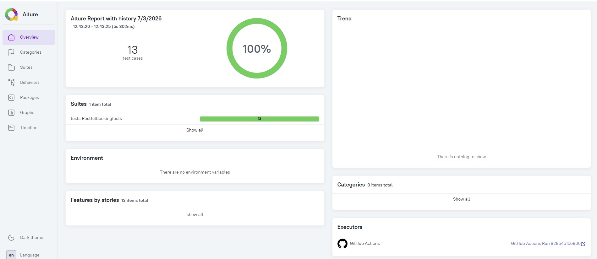
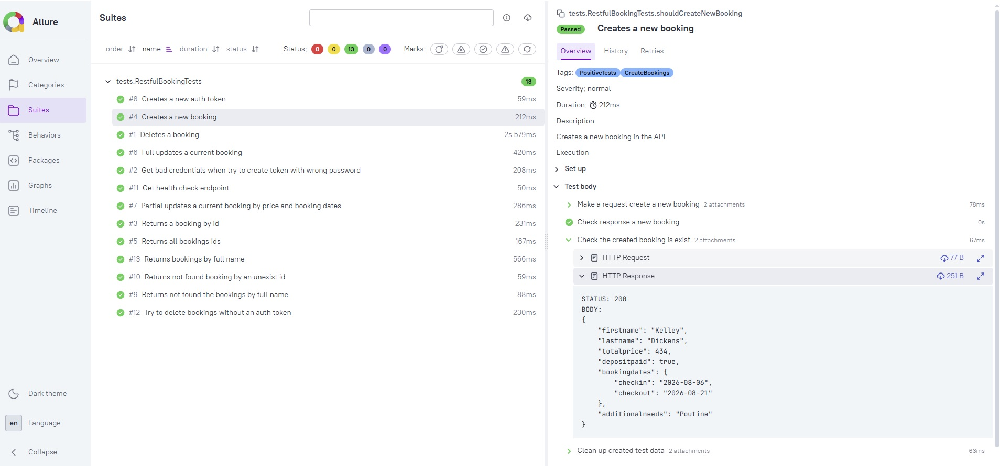

# REST API test for restful-booker service

[Link to Restful-Booker API Documentation](http://restful-booker.herokuapp.com/apidoc/index.html)

## 📃 Table of contents:
- [Technology stack](#-technology-stack)
- [Covered API endpoints & test cases](#-covered-api-endpoints--test-cases)
- [Project architecture](#-project-architecture)
- [Running tests using terminal](#-running-tests-using-terminal)
- [CI/CD Deployment in GitHub Actions](#-cicd-deployment-in-github-actions)
- [Allure reports & GitHub Pages integration](#-allure-reports--github-pages-integration)

## 💻 Technology stack
Java | Git | Gradle 9.0 | RestAssured | JUnit 6 | Owner (aeonbits) | Allure Reports | GitHubActions
<p>
<a href="https://www.java.com/"></a>
<a href="https://gradle.org/"></a>
<a href="https://rest-assured.io/"></a>
<a href="https://junit.org/"></a>
<a href="https://github.com/allure-framework/allure2"></a>
<a href="https://git-scm.com/"></a>
<a href="https://github.com/features/actions"></a>
</p>

## 📑 Covered API endpoints & test cases
### 🔐 Auth Module (`/auth`)
* **Positive test case:**
    * ✔ Create a new auth token with valid credentials
* **Negative test case:**
    * ❌Get bad credentials error when trying to create a token with an incorrect password
### 📅 Booking Module (`/booking`)
* **Positive test cases:**
  * ✔ Return all booking IDs filter list
  * ✔ Return bookings by full name
  * ✔ Return specific booking detailed information by ID
  * ✔ Create a new booking with dynamic test data
  * ✔ Full update current booking data using PUT request
  * ✔ Partial update current booking (price and dates) using PATCH request
  * ✔ Delete booking by ID using secure auth token validation
* **Negative test cases:**
  * ❌Return not found the bookings by full name
  * ❌Returns not found booking by an unexist id
  * ❌Try to delete bookings without an auth token

## 🏗 Project architecture
The test automation framework follows a clean, layered architecture that strictly separates protocol-level HTTP configurations, test data management, data models, and actual test scripts:
* **`api/` (API Client Layer)** — Contains HTTP request templates, endpoint specifications, and reusable API client helper methods. It encapsulates all protocol-specific configurations powered by RestAssured, separating them completely from the test logic.
* **`config/` (Configuration Layer)** — Manages environment-specific configurations and global settings using the Owner library. It automatically merges local configuration properties (`api.properties`), system variables, and CI system settings.
* **`data/` (Test Data Layer)** — Responsible for managing static test data and generating dynamic test inputs (e.g., random names, price bounds) to maintain test independence.
* **`models/` (Data Transfer Objects)** — Houses Java Records (DTOs)
* **`tests/` (Test Execution Layer)** — Contains independent, highly isolated JUnit 6 test suites. These tests focus purely on executing business-logic scenarios and validating assertions, keeping them clean, readable, and documentation-friendly.

## 🖥 Running tests using terminal
#### Command for local run:
*(Uses your local `api.properties` file for test credentials)*
```bash
./gradlew clean test
```
#### Command for custom environment run:
*(Overrides properties dynamically via CLI arguments)*
```bash
./gradlew test "-Dauth.username=<value username>" "-Dauth.password=value password" --no-daemon
```

## 🚀 CI/CD Deployment in GitHub Actions
The project features a completely automated build and test pipeline configured inside `.github/workflows/run-tests.yml`.
* **Triggers:** Runs automatically on every code `push` or `pull_request` to the `main` branch.
* **Security:** Sensitive credentials are secure and handled via Encrypted GitHub Repository Secrets (`AUTH_USERNAME` and `AUTH_PASSWORD`).
* **Environment:** Built on top of Ubuntu Linux running isolated steps with automated Gradle wrapper validation.

## 📊 Allure reports & GitHub Pages integration
[Link to Live Allure Reports on GitHub Pages](https://mikhail-malygin.github.io/restful-booker/)
#### Overview Dashboard
Detailed test summary reports featuring visual graphs, duration timelines, and specific execution metrics.

#### Suites & Test Structure
Detailed breakdown of each API step with full request/response logging integration for fast and efficient debugging.

#### Artifacts
Test runs automatically preserve raw test results as downloadable build artifacts inside GitHub Actions for up to 5 days.